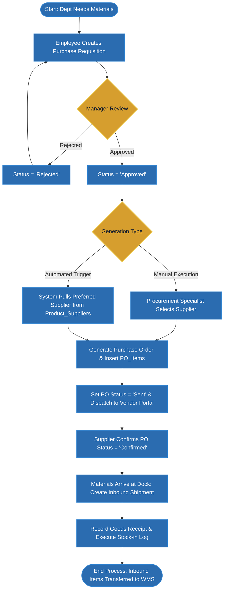
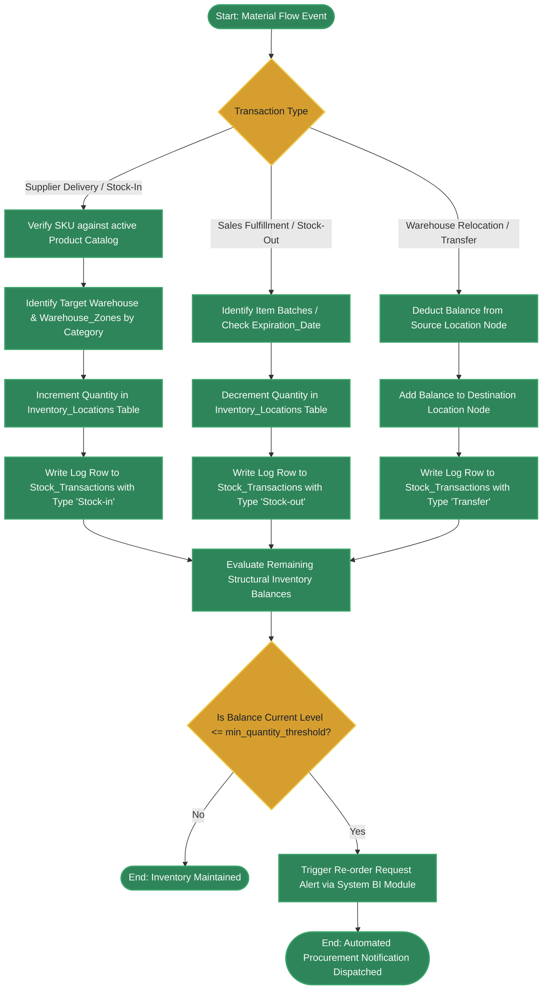
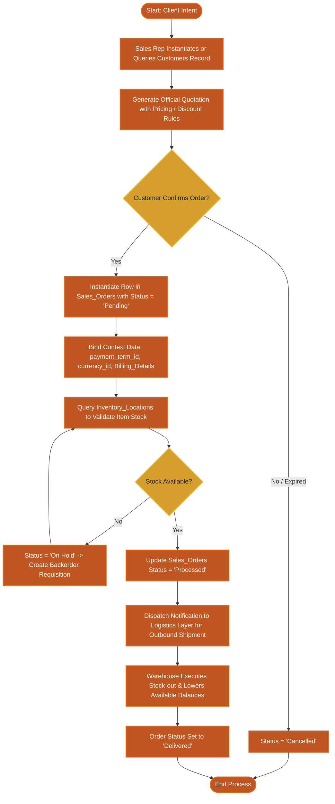
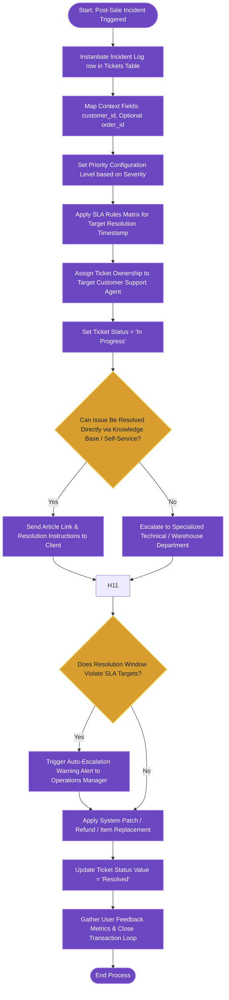

# 🔄 Deep-Dive Functional Sub-Process Flowcharts

This document details the step-by-step logic gates, status transitions, and data writes occurring within each core operational module of the AmbatuGrow ERP system.

---

## 📥 A. Procurement & Purchase Order Lifecycle Process

This process governs the acquisition of vendor inventory, detailing everything from the creation of internal requisitions to physical stock receipt.

### Key Stages
1. **Requisition Stage**: Requisitions originate from departments. An approval gate prevents un-budgeted purchasing.
2. **PO Dispatch**: Purchases are routed dynamically based on Preferred Supplier configurations or manually processed.
3. **Goods Inbound**: Warehouse receipt of products logs inventory and closes out the active Purchase Order.

---

## 📦 B. Product Inventory & Warehouse Management (WMS) Process

This process details warehouse transactions, localization tracking, and automated inventory safety thresholds.

### Key Stages
1. **Flow Verification**: Ensures only registered SKUs enter warehouse stock.
2. **Zone Allocation**: Organizes warehouse layout by assigning incoming products to zones (e.g., cold storage, hazardous, standard racks).
3. **Double-Entry Stock Transactions**: Every transfer deducts from source and adds to destination, ensuring zero missing quantities.
4. **Safety Threshold Check**: Automated scanning of stock levels triggers BI notifications to avoid stockouts.

---

## 🏷️ C. Sales & Customer Management (CRM) Process

This workflow charts the processing of customer demands, transforming a raw quote into an active shipment.

### Key Stages
1. **Quotation Stage**: Sales Representatives query Customer Master records and apply regional price books or discount matrices.
2. **Commit Gate**: Confirmed quotes update to Sales Orders, locking in transaction details (currencies, payment terms).
3. **Availability Hold**: If stock is unavailable, orders are put on hold and backordered via the Procurement system.
4. **Fulfillment & Delivery**: Handover to warehouse for dispatch, final delivery receipt, and order completion.

---

## 🛠️ D. Helpdesk & Post-Sale Case Resolution Process

This workflow tracks incoming post-sale inquiries to ensure compliance with service agreement windows.

### Key Stages
1. **Ticket Creation**: Tickets link customers to orders, ensuring full context.
2. **SLA Assignment**: Escalation deadlines are mapped instantly based on severity (Low, Medium, High).
3. **Self-Service Check**: First-line support searches the solutions knowledge base to reduce team load.
4. **SLA Monitoring & Escalation**: Background tasks verify ticket age; breaches trigger operational manager alerts.
