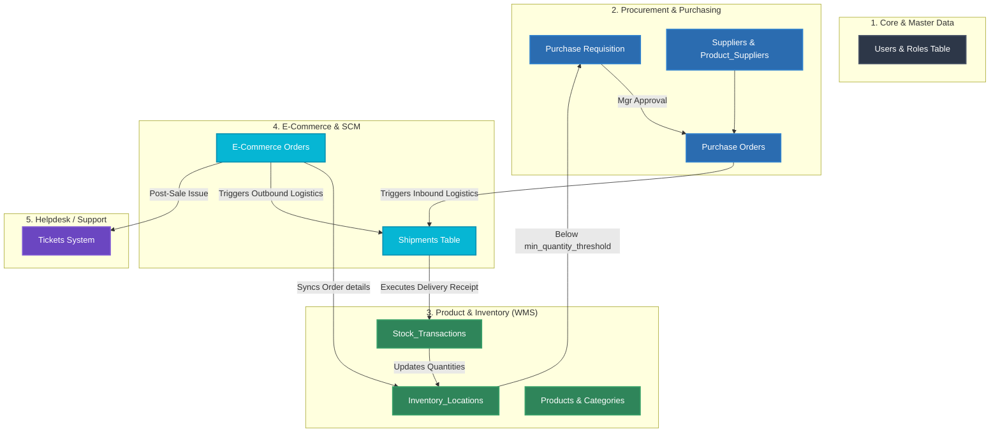

# 🌐 End-to-End Cross-Functional System Orchestration

This architecture map displays how data transitions horizontally across system boundaries, tracking the operational flow across Procurement, WMS, Supply Chain (SCM), E-Commerce, and Helpdesk.

---

## Orchestration Flowchart

---

## 🔄 Core Data Transition Paths

### 1. Procurement Replenishment Pipeline (Procurement ➡️ Inventory)
* **Reorder Trigger**: When WMS inventory levels inside `Inventory_Locations` drop below the safety limit (`min_quantity_threshold`), the system flags a `Purchase Requisition`.
* **Purchase Dispatch**: Approved requisitions generate a `Purchase Order` sent to suppliers.
* **Goods Receipt**: Dock deliveries trigger an inbound `Shipment` update, logging a `Stock_Transaction` (Type = 'Stock-in') and incrementing inventory quantities.

### 2. Digital Fulfillment Pipeline (E-Commerce ➡️ WMS ➡️ Logistics)
* **Order Sync**: E-Commerce order checkout details are synced immediately into the WMS, reserving inventory and decrementing available levels via a `Stock_Transaction` (Type = 'Stock-out').
* **Outbound Dispatch**: The system schedules outbound logistics shipments inside the `Shipments` table.
* **Post-Sale SLA Support**: If customer delivery issues arise, the order metadata references feed directly into the Helpdesk `Tickets` system to track support resolutions.
