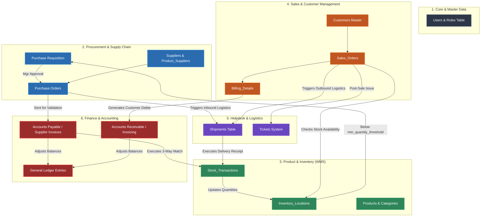

# 🌐 End-to-End Cross-Functional System Orchestration

This architecture map displays how data transitions horizontally across system boundaries, tracking the operational flow from a purchase or sales trigger down to ledger adjustment.

---

## Orchestration Flowchart

---

## 🔄 Core Data Transition Paths

### 1. Inbound Materials Pipeline (Procurement ➡️ Inventory ➡️ Accounting)
* **Reorder Trigger**: When stock in `Inventory_Locations` falls below the `min_quantity_threshold` defined on a product, the system automatically flags a `Purchase Requisition` request.
* **Order Generation**: Once authorized, a `Purchase Order` (PO) is generated and dispatched to the supplier.
* **Logistics Receipt**: When goods arrive at the loading dock, a `Shipment` record is created, which generates a `Stock_Transaction` (Type = 'Stock-in') and updates the physical balance inside `Inventory_Locations`.
* **3-Way Match Validation**: Accounts Payable receives the supplier's invoice and validates it by executing a 3-way match comparing the original **Purchase Order**, the **Goods Receipt (Stock Transaction)**, and the **Invoice**. Once validated, the invoice is approved and balances are adjusted in the **General Ledger**.

### 2. Outbound Fulfillment Pipeline (CRM ➡️ Inventory ➡️ Logistics ➡️ Finance)
* **Order Creation**: A client places an order, which queries the `Inventory_Locations` table to check current stock availability.
* **Stock Allocation & Shipment**: If available, the `Sales_Order` status updates, triggering a new outbound `Shipment` log.
* **Stock Decrement**: The WMS deducts the items from the corresponding location node and writes a `Stock_Transaction` (Type = 'Stock-out').
* **Receivables & General Ledger**: A customer invoice is compiled based on `Billing_Details` which generates an `Accounts_Receivable` record. Once payment is recorded, the **General Ledger** is automatically updated.
* **Post-Sale SLA**: If the customer runs into issues post-delivery, the order references can trigger a support request inside the `Tickets` system, matching the client back to their communication history.
