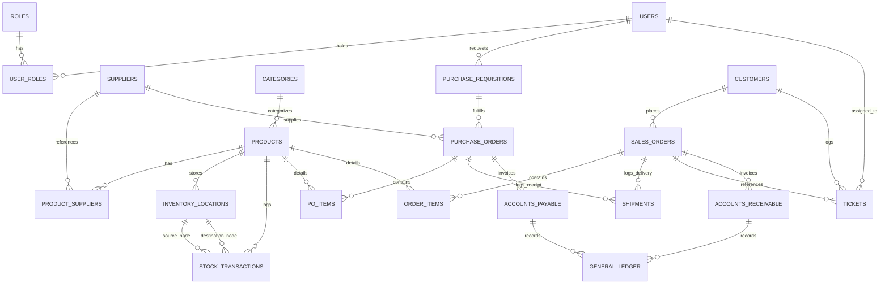

# 🗄️ Database Entity Relationship Diagram (ERD)

This document outlines the database architecture for the AmbatuGrow ERP system. It illustrates table relationships, primary keys, foreign keys, and crucial operational attributes.

---

## 🗺️ Entity Relationship Map

The following Mermaid diagram maps the database relationships across modules.

---

## 📋 Data Dictionary & Table Definitions

### 1. Identity & Access Control
* **`USERS`**: System user records linked to departments.
* **`ROLES`**: Defined roles (e.g., WMS Manager, Accountant, Procurement Specialist).
* **`USER_ROLES`**: Many-to-many join table mapping users to roles.

### 2. Inventory & WMS
* **`PRODUCTS`**: Core catalog listing SKUs, unit costs, pricing, and reorder thresholds.
* **`CATEGORIES`**: Product grouping (e.g., Electronics, Raw Materials).
* **`INVENTORY_LOCATIONS`**: Physical warehouse bin positions, storing item balances.
* **`STOCK_TRANSACTIONS`**: Logs of physical stock changes (`stock-in`, `stock-out`, `transfer`).

### 3. Purchasing & Suppliers
* **`SUPPLIERS`**: Supplier directories, contract terms, and ratings.
* **`PRODUCT_SUPPLIERS`**: Cross-references mapping preferred vendors and costs to SKUs.
* **`PURCHASE_REQUISITIONS`**: Employee requests for purchasing.
* **`PURCHASE_ORDERS`**: Outbound vendor orders.
* **`PO_ITEMS`**: Detailed lists of items, unit costs, and quantities in a PO.

### 4. Sales & CRM
* **`CUSTOMERS`**: Customer profiles, delivery addresses, and payment terms.
* **`SALES_ORDERS`**: Customer orders containing invoicing details.
* **`ORDER_ITEMS`**: Specific items, pricing, and quantities for sales orders.

### 5. Helpdesk & Logistics
* **`SHIPMENTS`**: Inbound or outbound logistical records tracking carrier information.
* **`TICKETS`**: Support incident logs, tracking resolution deadlines based on SLA rules.

### 6. Finance & Accounting
* **`ACCOUNTS_PAYABLE`**: Supplier invoices matching POs, held for verification.
* **`ACCOUNTS_RECEIVABLE`**: Customer invoices compiled from orders.
* **`GENERAL_LEDGER`**: Central ledger storing double-entry credits and debits.

---

## 🛠️ Table Specifications (SQL Data Types)

```mermaid
erDiagram
    USERS {
        int id PK
        string username
        string email
        string password
        int department_id FK
    }
    ROLES {
        int id PK
        string role_name
        string description
    }
    USER_ROLES {
        int user_id PK, FK
        int role_id PK, FK
    }
    PRODUCTS {
        int id PK
        string sku UK
        string name
        string description
        int category_id FK
        decimal price
        int min_quantity_threshold
    }
    CATEGORIES {
        int id PK
        string category_name
        string description
    }
    SUPPLIERS {
        int id PK
        string name
        string contact_person
        string email
        string phone
        string contract_terms
    }
    PRODUCT_SUPPLIERS {
        int product_id PK, FK
        int supplier_id PK, FK
        decimal cost_price
        boolean is_preferred
    }
    INVENTORY_LOCATIONS {
        int id PK
        string warehouse_name
        string zone_name
        int product_id FK
        int quantity
    }
    STOCK_TRANSACTIONS {
        int id PK
        int product_id FK
        string transaction_type "stock-in | stock-out | transfer"
        int source_location_id FK "nullable"
        int destination_location_id FK "nullable"
        int quantity
        timestamp transaction_date
        string reference_no
    }
    PURCHASE_REQUISITIONS {
        int id PK
        int employee_id FK
        int manager_id FK "nullable"
        string status "pending | approved | rejected"
        text justification
        timestamp created_at
    }
    PURCHASE_ORDERS {
        int id PK
        int requisition_id FK "nullable"
        int supplier_id FK
        string status "draft | sent | confirmed | delivered | cancelled"
        decimal total_amount
        timestamp ordered_at
    }
    PO_ITEMS {
        int id PK
        int purchase_order_id FK
        int product_id FK
        int quantity
        decimal unit_cost
    }
    CUSTOMERS {
        int id PK
        string company_name
        string contact_name
        string email
        string phone
        text billing_address
        text shipping_address
    }
    SALES_ORDERS {
        int id PK
        int customer_id FK
        string status "draft | pending | processed | shipped | delivered | cancelled"
        int payment_term_id FK
        int currency_id FK
        decimal total_amount
        timestamp ordered_at
    }
    ORDER_ITEMS {
        int id PK
        int sales_order_id FK
        int product_id FK
        int quantity
        decimal unit_price
    }
    SHIPMENTS {
        int id PK
        string shipment_type "inbound | outbound"
        int reference_id "PO_ID or SO_ID"
        string carrier_name
        string tracking_number
        string status "pending | shipped | transit | delivered"
        timestamp shipped_at
        timestamp estimated_delivery
    }
    TICKETS {
        int id PK
        int customer_id FK
        int order_id FK "nullable"
        string priority "low | medium | high"
        string status "open | in_progress | resolved | closed"
        int assigned_agent_id FK "nullable"
        timestamp sla_deadline
        text description
    }
    ACCOUNTS_PAYABLE {
        int id PK
        int purchase_order_id FK
        string invoice_number
        decimal amount
        string status "unpaid | partially_paid | paid | disputed"
        date due_date
    }
    ACCOUNTS_RECEIVABLE {
        int id PK
        int sales_order_id FK
        string invoice_number
        decimal amount
        string status "unpaid | partially_paid | paid | overdue"
        date due_date
    }
    GENERAL_LEDGER {
        int id PK
        date entry_date
        string account_code
        string account_name
        decimal debit
        decimal credit
        string reference_no
        string description
    }
```

