# 🗄️ Database Entity Relationship Diagram (ERD)

This document outlines the database architecture for the AmbatuGrow ERP system. It illustrates table relationships, primary keys, foreign keys, and crucial operational attributes, incorporating the database-backed Role-Based Access Control (RBAC) security tables.

---

## 🗺️ Entity Relationship Map

The following Mermaid diagram maps the database relationships across modules. It showcases the RBAC structure (`Permissions` and `Role_Permissions`) alongside the core ERP schema tables.

```mermaid
erDiagram
    USERS ||--|| ROLES : belongs_to
    ROLES ||--o{ ROLE_PERMISSIONS : maps
    PERMISSIONS ||--o{ ROLE_PERMISSIONS : maps
    
    USERS ||--o{ PURCHASE_ORDERS : creates
    
    ADDRESSES ||--o{ WAREHOUSES : locates
    ADDRESSES ||--o{ SUPPLIERS : locates
    ADDRESSES ||--o{ CUSTOMERS : locates
    ADDRESSES ||--o{ BILLING_DETAILS : locates
    ADDRESSES ||--o{ SHIPMENTS : locates
    
    CURRENCIES ||--o{ PRODUCTS : rates
    CURRENCIES ||--o{ PURCHASE_ORDERS : rates
    CURRENCIES ||--o{ SALES_ORDERS : rates
    
    UNITS_OF_MEASURE ||--o{ PRODUCTS : measures
    UNITS_OF_MEASURE ||--o{ PO_ITEMS : measures
    
    PAYMENT_TERMS ||--o{ PURCHASE_ORDERS : applies_to
    PAYMENT_TERMS ||--o{ SALES_ORDERS : applies_to
    
    CATEGORIES ||--o{ CATEGORIES : parent_child
    CATEGORIES ||--o{ PRODUCTS : categorizes
    
    PRODUCTS ||--o{ PRODUCT_SUPPLIERS : junction
    SUPPLIERS ||--o{ PRODUCT_SUPPLIERS : junction
    
    PRODUCTS ||--o{ INVENTORY_LOCATIONS : stores
    WAREHOUSES ||--o{ INVENTORY_LOCATIONS : stores
    WAREHOUSE_ZONES ||--o{ INVENTORY_LOCATIONS : stores
    WAREHOUSES ||--o{ WAREHOUSE_ZONES : contains
    
    PRODUCTS ||--o{ STOCK_TRANSACTIONS : logs
    WAREHOUSES ||--o{ STOCK_TRANSACTIONS : logs
    
    PURCHASE_ORDERS ||--o{ PO_ITEMS : contains
    PRODUCTS ||--o{ PO_ITEMS : details
    SUPPLIERS ||--o{ PURCHASE_ORDERS : supplies
    SUPPLIERS ||--o{ SUPPLIER_INVOICES : bills
    PURCHASE_ORDERS ||--o{ SUPPLIER_INVOICES : bills
    
    CUSTOMERS ||--o{ SALES_ORDERS : places
    CUSTOMERS ||--o{ TICKETS : logs
    SALES_ORDERS ||--o{ TICKETS : references
    SALES_ORDERS ||--o{ BILLING_DETAILS : bills
    
    SHIPMENTS ||--|| SALES_ORDERS : delivers_outbound
    SHIPMENTS ||--|| PURCHASE_ORDERS : receives_inbound
```

---

## 📋 Data Dictionary & Table Definitions

### 1. Core & Master Data

#### `Roles`
* **`role_id`** (INT, PK): Unique identifier for each role.
* **`role_name`** (VARCHAR(50)): Name of the security role.
* **`description`** (TEXT): Operational description of duties.

#### `Users`
* **`user_id`** (INT, PK): Unique identifier for each user.
* **`username`** (VARCHAR(50)): System username.
* **`password_hash`** (VARCHAR(255)): Secure password hash.
* **`email`** (VARCHAR(100)): Primary contact email.
* **`role_id`** (INT, FK -> `Roles`): Link to security role.
* **`status`** (ENUM('Active', 'Inactive', 'Suspended')): User status.

#### `Permissions` [RBAC Table]
* **`permission_id`** (INT, PK): Unique identifier for each permission.
* **`permission_name`** (VARCHAR(100), UNIQUE): Name of permission (e.g. `CREATE_PURCHASE_ORDER`).
* **`module_name`** (VARCHAR(50)): Associated ERP module.
* **`description`** (TEXT): Context of what action this allows.

#### `Role_Permissions` [RBAC Table]
* **`role_id`** (INT, FK -> `Roles` / Composite PK): Associated role.
* **`permission_id`** (INT, FK -> `Permissions` / Composite PK): Permitted action.

#### `Addresses`
* **`address_id`** (INT, PK): Unique identifier.
* **`street`** (VARCHAR(255)): Street details.
* **`city`** (VARCHAR(100)): City.
* **`province`** (VARCHAR(100)): State/Province.
* **`zipcode`** (VARCHAR(20)): Postal code.
* **`country`** (VARCHAR(100)): Country name.

#### `Units_of_Measure`
* **`uom_id`** (INT, PK): Unique identifier.
* **`uom_code`** (VARCHAR(10)): Short acronym (e.g., `PCS`, `KG`).
* **`uom_name`** (VARCHAR(50)): Full title.
* **`description`** (TEXT): Context parameters.

#### `Payment_Terms`
* **`payment_term_id`** (INT, PK): Unique identifier.
* **`term_code`** (VARCHAR(20)): Term abbreviation (e.g. `NET30`).
* **`description`** (TEXT): Detailed payment timeline details.
* **`net_days`** (INT): Total days allowed for settlement.
* **`discount_percent`** (DECIMAL(5,2)): Percentage discount if paid early.

#### `Currencies`
* **`currency_id`** (INT, PK): Unique identifier.
* **`currency_code`** (CHAR(3)): Standard ISO code (e.g. `USD`, `PHP`).
* **`currency_name`** (VARCHAR(50)): Currency title.
* **`exchange_rate`** (DECIMAL(10,4)): Multiplier relative to base company currency.

---

### 2. Product & Inventory Management (PIM / WMS)

#### `Categories`
* **`category_id`** (INT, PK): Unique identifier.
* **`category_name`** (VARCHAR(100)): Category title.
* **`parent_category_id`** (INT, FK -> `Categories`, Nullable): Adjacency list for hierarchies.

#### `Products`
* **`product_id`** (INT, PK): Unique identifier.
* **`sku`** (VARCHAR(50), UNIQUE): Stock Keeping Unit string.
* **`name`** (VARCHAR(255)): Marketing product name.
* **`description`** (TEXT): Physical product properties.
* **`category_id`** (INT, FK -> `Categories`): Product category link.
* **`uom_id`** (INT, FK -> `Units_of_Measure`): Physical unit mapping.
* **`currency_id`** (INT, FK -> `Currencies`): Default pricing currency.
* **`base_price`** (DECIMAL(10,2)): Base catalog price.
* **`min_quantity_threshold`** (DECIMAL(10,2)): Safety limit.
* **`lead_time_days`** (INT): Vendor lead time estimate.

#### `Warehouses`
* **`warehouse_id`** (INT, PK): Unique identifier.
* **`name`** (VARCHAR(100)): Warehouse identifier.
* **`address_id`** (INT, FK -> `Addresses`): Physical address.
* **`capacity_sqm`** (DECIMAL(10,2)): Floor space area.

#### `Warehouse_Zones`
* **`zone_id`** (INT, PK): Unique zone identifier.
* **`warehouse_id`** (INT, FK -> `Warehouses`): Parent warehouse.
* **`zone_name`** (VARCHAR(50)): Zone title.
* **`category`** (VARCHAR(50)): Environmental controls (e.g. `Frozen`, `Bulk`).

#### `Inventory_Locations`
* **`inventory_id`** (INT, PK): Unique locator ID.
* **`product_id`** (INT, FK -> `Products`): Stored SKU.
* **`warehouse_id`** (INT, FK -> `Warehouses`): Target facility.
* **`zone_id`** (INT, FK -> `Warehouse_Zones`): Target zone inside facility.
* **`quantity`** (DECIMAL(10,2)): Actual physical count.
* **`expiration_date`** (DATE, Nullable): Expiry limit.

#### `Stock_Transactions`
* **`transaction_id`** (INT, PK): Unique tracker.
* **`product_id`** (INT, FK -> `Products`): Material SKU.
* **`warehouse_id`** (INT, FK -> `Warehouses`): Facility location.
* **`transaction_type`** (ENUM('Stock-in', 'Stock-out', 'Transfer')): Direction.
* **`quantity`** (DECIMAL(10,2)): Movement change amount.
* **`transaction_date`** (DATETIME): Timestamp.
* **`reference_id`** (INT, FK -> Polymorphic): Linking POs, Sales Orders, or Transfer IDs.

---

### 3. Procurement & Supply Chain (SCM)

#### `Suppliers`
* **`supplier_id`** (INT, PK): Unique supplier ID.
* **`supplier_name`** (VARCHAR(255)): Registered vendor name.
* **`category`** (VARCHAR(100)): Supply vertical (e.g. `Hardware`, `Logistics`).
* **`email`** (VARCHAR(100)): Primary PO inbox.
* **`phone`** (VARCHAR(20)): Phone number.
* **`address_id`** (INT, FK -> `Addresses`): Corporate address.
* **`status`** (ENUM('Active', 'Inactive', 'Blacklisted')): Vendor standing.

#### `Product_Suppliers` (4NF Junction Table)
* **`product_id`** (INT, FK / Composite PK): Product link.
* **`supplier_id`** (INT, FK / Composite PK): Supplier link.
* **`supplier_sku`** (VARCHAR(50)): Supplier's SKU code.
* **`unit_price`** (DECIMAL(10,2)): Supplier wholesale cost.
* **`lead_time_days`** (INT): Dispatch timeframe.
* **`is_preferred`** (TINYINT(1)): Priority procurement marker.

#### `Purchase_Orders`
* **`po_id`** (INT, PK): Unique PO ID.
* **`po_number`** (VARCHAR(50), UNIQUE): Alphanumeric document identifier.
* **`supplier_id`** (INT, FK -> `Suppliers`): Target vendor.
* **`requisition_id`** (INT, FK, Nullable): Reference link to source PR.
* **`payment_term_id`** (INT, FK -> `Payment_Terms`): PO payment terms.
* **`currency_id`** (INT, FK -> `Currencies`): Settled currency.
* **`status`** (VARCHAR(50)): Order status (e.g. `Sent`, `Confirmed`).
* **`order_date`** (DATETIME): Order timestamp.
* **`created_by`** (INT, FK -> `Users`): Specialist creator.

#### `PO_Items`
* **`po_item_id`** (INT, PK): Line item PK.
* **`po_id`** (INT, FK -> `Purchase_Orders`): Parent order.
* **`product_id`** (INT, FK -> `Products`): Purchased SKU.
* **`quantity`** (DECIMAL(10,2)): Requested count.
* **`uom_id`** (INT, FK -> `Units_of_Measure`): Physical unit mapping.
* **`unit_price`** (DECIMAL(10,2)): Locked contract cost.

#### `Supplier_Invoices`
* **`invoice_id`** (INT, PK): Invoice PK.
* **`supplier_id`** (INT, FK -> `Suppliers`): Billing vendor.
* **`po_id`** (INT, FK -> `Purchase_Orders`): Linked purchase order.
* **`invoice_number`** (VARCHAR(100)): Vendor's reference code.
* **`invoice_date`** (DATE): Billing issue date.
* **`due_date`** (DATE): Net terms deadline date.

---

### 4. Sales & Customer Management (CRM)

#### `Customers`
* **`customer_id`** (INT, PK): Customer PK.
* **`first_name`** (VARCHAR(100)): First name.
* **`last_name`** (VARCHAR(100)): Last name.
* **`email`** (VARCHAR(100)): Billing email.
* **`phone`** (VARCHAR(20)): Phone.
* **`address_id`** (INT, FK -> `Addresses`): Customer delivery location.

#### `Sales_Orders`
* **`order_id`** (INT, PK): Sales Order PK.
* **`customer_id`** (INT, FK -> `Customers`): Requesting customer.
* **`rep_id`** (INT, FK -> `Sales_Representatives`): Handling agent.
* **`order_date`** (DATETIME): Timestamp.
* **`status`** (VARCHAR(50)): Order progress status.
* **`payment_term_id`** (INT, FK -> `Payment_Terms`): CRM payment terms.
* **`currency_id`** (INT, FK -> `Currencies`): Quoted currency.

#### `Billing_Details`
* **`billing_id`** (INT, PK): Billing record.
* **`order_id`** (INT, FK -> `Sales_Orders`): Sales order.
* **`address_id`** (INT, FK -> `Addresses`): Invoice destination address.
* **`payment_method`** (VARCHAR(50)): Method (e.g. `Credit Card`, `Bank Transfer`).

---

### 5. Helpdesk & Logistics

#### `Tickets`
* **`ticket_id`** (INT, PK): Support Ticket PK.
* **`customer_id`** (INT, FK -> `Customers`): Ticket creator.
* **`order_id`** (INT, FK, Nullable): Associated purchase order reference.
* **`subject`** (VARCHAR(255)): Ticket summary.
* **`priority`** (ENUM('Low', 'Medium', 'High', 'Critical')): Ticket urgency.

#### `Shipments`
* **`shipment_id`** (INT, PK): Shipment identifier.
* **`reference_type`** (ENUM('Inbound', 'Outbound')): Transit type.
* **`reference_id`** (INT, FK -> Polymorphic): Links to `po_id` (inbound) or `order_id` (outbound).
* **`destination_address_id`** (INT, FK -> `Addresses`): Shipping address.
