# 🔐 Role-Based Access Control (RBAC) System Architecture

This document defines the Role-Based Access Control (RBAC) security governance framework for the AmbatuGrow ERP system. It manages user permissions and module access to ensure data security and accountability.

---

## 🗺️ RBAC Security Map

The following Mermaid diagram visualizes the relationships between system Roles and ERP Modules.

```mermaid
graph TD
    %% Styling Definitions
    classDef roles fill:#5a67d8,stroke:#434190,stroke-width:2px,color:#fff;
    classDef modules fill:#319795,stroke:#234e52,stroke-width:2px,color:#fff;
    classDef admin fill:#e53e3e,stroke:#9b2c2c,stroke-width:2px,color:#fff;

    subgraph Security_Roles ["ERP Access Roles"]
        SA[Super Admin]:::admin
        PE[General Employee]:::roles
        PM[Project Manager]:::roles
        HRM[HR Manager]:::roles
        SR[Sales Rep]:::roles
        CS[Support Rep]:::roles
        WMM[WMS Manager]:::roles
        WO[Warehouse Operator]:::roles
        PS[Procurement Specialist]:::roles
        ECA[E-Commerce Admin]:::roles
    end

    subgraph ERP_Modules ["Functional ERP Modules"]
        M_Core[Core Master Data]:::modules
        M_Proc[Procurement & Purchasing]:::modules
        M_WMS[Inventory & WMS]:::modules
        M_SCM[Supply Chain & Logistics]:::modules
        M_Sales[Sales & CRM]:::modules
        M_Help[Helpdesk & Tickets]:::modules
        M_ECom[E-Commerce Integration]:::modules
        M_Proj[Project Management]:::modules
        M_HR[Human Resources]:::modules
        M_BI[Business Intelligence]:::modules
    end

    %% Role-Module Access Bindings
    SA -->|Full Control| M_Core
    SA -->|Full Control| M_BI

    PE -->|Submit Requests| M_Proc
    PE -->|View/Log Tasks| M_Proj
    PE -->|File Support Tickets| M_Help
    PE -->|View Personal Record| M_HR

    PM -->|Manage Projects & Budgets| M_Proj
    PM -->|Read Assignee Lists| M_HR

    HRM -->|Full HR Control| M_HR
    HRM -->|Read Worklogs| M_Proj

    SR -->|Manage Quotes & Orders| M_Sales
    SR -->|Read Inventory Stock| M_WMS
    SR -->|Sync Customers| M_ECom

    CS -->|Manage Tickets & SLAs| M_Help
    CS -->|Read Sales Orders| M_Sales

    WMM -->|Manage Stock Configurations| M_WMS
    WMM -->|Oversee Logistics| M_SCM
    WMM -->|Read Incoming POs| M_Proc

    WO -->|Log Stock Transactions| M_WMS
    WO -->|Update Inbound Receipt| M_SCM

    PS -->|Submit POs & Manage Vendors| M_Proc
    PS -->|Coordinate Deliveries| M_SCM
    PS -->|Read Stock Thresholds| M_WMS

    ECA -->|Manage Channel Integration| M_ECom
    ECA -->|Read WMS Inventory| M_WMS
    ECA -->|Read E-Com Customers| M_Sales
```

---

## 📊 Role-Permission Matrix

The table below indicates the exact permission level for each role across modules, using fully written-out, clear values.

| Security Role | Core Master Data | Procurement | Inventory & WMS | Supply Chain | Sales & CRM | Helpdesk | E-Commerce | Project Mgmt | HR | BI Reports |
| :--- | :---: | :---: | :---: | :---: | :---: | :---: | :---: | :---: | :---: | :---: |
| **Super Admin** | Full Access | Full Access | Full Access | Full Access | Full Access | Full Access | Full Access | Full Access | Full Access | Full Access |
| **General Employee** | No Access | Read & Write *(PR)* | No Access | No Access | No Access | Read & Write *(Ticket)* | No Access | Read & Write *(Task)* | Read-Only *(Self)* | No Access |
| **Project Manager** | No Access | No Access | No Access | No Access | No Access | No Access | No Access | Full Access | Read-Only *(Staff)* | Read-Only |
| **HR Manager** | No Access | No Access | No Access | No Access | No Access | No Access | No Access | Read-Only | Full Access | Read-Only |
| **Sales Rep** | No Access | No Access | Read-Only *(Stock)* | No Access | Read & Write | Read-Only | Read & Write | No Access | No Access | Read-Only |
| **Support Rep** | No Access | No Access | No Access | No Access | Read-Only *(Orders)* | Read & Write | No Access | No Access | No Access | Read-Only |
| **WMS Manager** | No Access | Read-Only *(PO)* | Full Access | Read & Write | No Access | No Access | Read-Only | No Access | No Access | Read-Only |
| **Warehouse Operator** | No Access | No Access | Read & Write | Read & Write | No Access | No Access | No Access | No Access | No Access | No Access |
| **Procurement Specialist** | No Access | Read & Write | Read-Only | Read & Write | No Access | No Access | No Access | No Access | No Access | Read-Only |
| **E-Commerce Admin** | No Access | No Access | Read-Only | No Access | Read-Only | No Access | Read & Write | No Access | No Access | Read-Only |

---

## 👥 Role Descriptions

### 1. Administrative Roles
* **Super Admin**: The global administrator. Maintains systemic operations, database health, integrations, global role configuration, and audit logging.
* **General Employee**: A baseline company worker. Allowed to create purchase requisitions (procurement pipeline), file support tickets, view personal payroll/leave history, and update assigned tasks.

### 2. Supply Chain & Operations
* **WMS Manager**: Manages warehouse configuration, zones, minimum inventory metrics, catalog details, and transfers.
* **Warehouse Operator**: Focuses on material movement. Performs physical stock counts, writes stock transactions (`stock-in`, `stock-out`, `transfer`), and tracks inbound delivery receipts.
* **Procurement Specialist**: Responsible for purchasing operations. Manages suppliers catalogs, vendor ratings, contracts, PO generation, and coordinates inbound logistics with the WMS.

### 3. Sales & Customer Support
* **Sales Representative**: Deals directly with customers. Instantiates customer records, manages quotations and sales order lifecycles, and maintains the e-commerce product sync parameters.
* **Customer Support Agent**: Handles client tickets. Assigns, updates, escalates support incidents, and checks sales order references to ensure compliance with service agreement windows (SLAs).

### 4. Human Resources
* **HR Manager**: Manages the employee lifecycle. Oversees personal records, hiring pipelines, leaf allocations, biometric attendance data, and processes payroll inputs.
